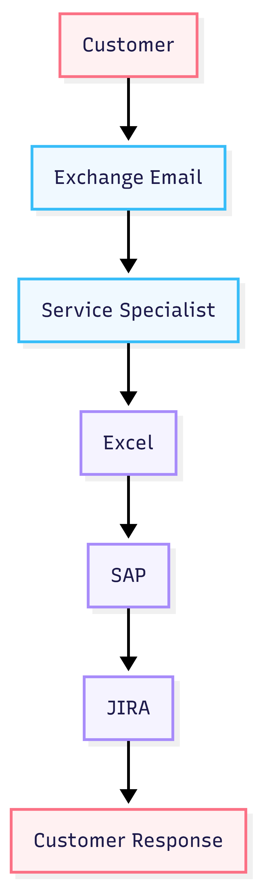

# Event Storming AS-IS

This diagram presents the current complaint handling process before automation.

## Main Characteristics

- Complaint handling is mostly manual
- Complaint data is copied manually to Excel
- Classification depends on specialist interpretation
- SAP and JIRA are not integrated
- Reporting capabilities are limited

## Main Pain Points

- Delayed email processing
- Human bottleneck
- Manual data entry
- Inconsistent categorization
- Lack of operational analytics

## Diagram

