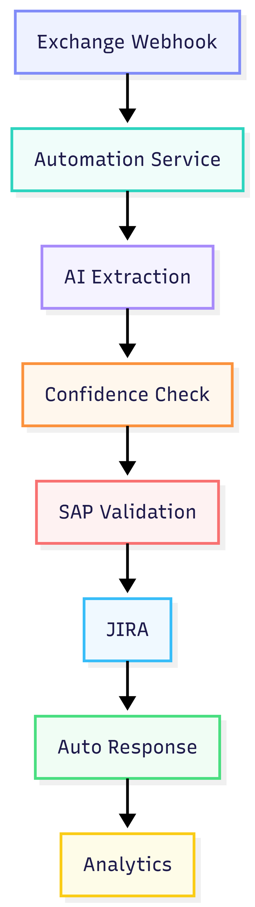

# Event Storming TO-BE

This diagram presents the proposed automated complaint handling process.

## Main Improvements

- Automatic email intake using Microsoft Graph webhooks
- AI-based complaint extraction and categorization
- SAP validation automation
- Automatic JIRA ticket creation
- AI-assisted customer response generation
- KPI and analytics support

## Human-in-the-loop Approach

The system introduces confidence-based processing.

Low confidence complaints are redirected
to manual verification.

This reduces the risk of incorrect automated decisions.

## Benefits

- Faster response times
- Reduced manual work
- Standardized classification
- Better reporting and analytics
- Better scalability during seasonal peaks

## Diagram

