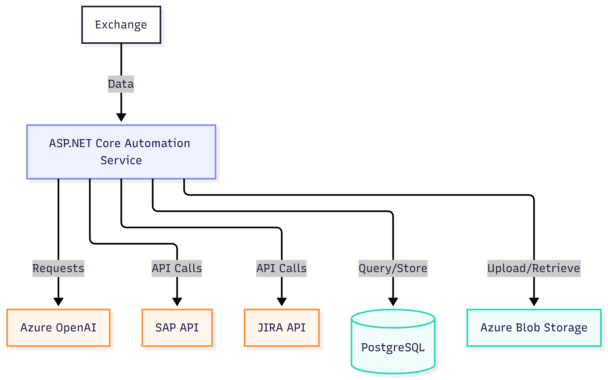

# Solution Architecture

## Architecture Overview

The proposed solution uses an event-driven architecture
integrating Exchange, AI services, SAP and JIRA.

## Main Components

### Microsoft Exchange Integration
Incoming complaint emails are detected using
Microsoft Graph API webhooks.

### Automation Service
Central orchestration layer responsible for:
- complaint processing,
- integrations,
- AI communication,
- workflow handling.

Proposed technology:
- ASP.NET Core Web API

### AI Processing Layer
AI is responsible for:
- extracting order information,
- language detection,
- complaint categorization,
- generating customer response drafts.

### SAP Integration
The system retrieves:
- order details,
- batch information,
- production metadata.

### JIRA Integration
Automatic creation of:
- Complaint tickets,
- Correction tickets.

### Blob Storage
Complaint images are archived in Azure Blob Storage.

### Analytics Layer
Operational data can be stored for:
- KPI reporting,
- quality analytics,
- production issue tracking.

## Architecture Diagram

